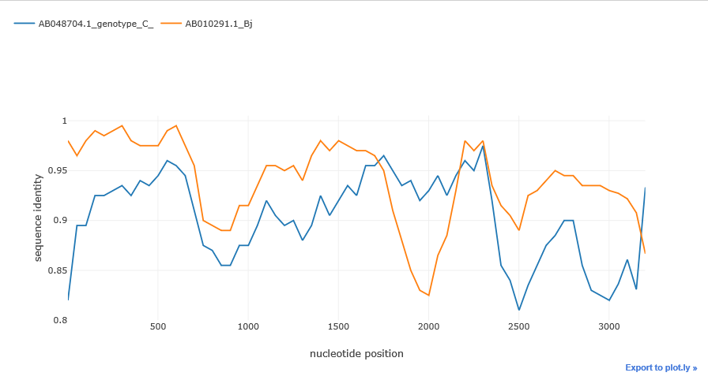
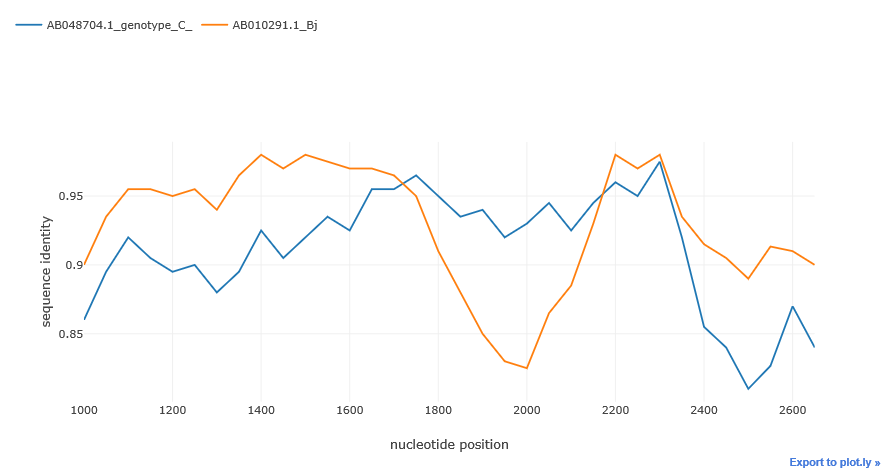

# recan
`recan` is a Python library to test DNA sequences for recombination events using distance plots. It is intended to be used in the Jupyter notebook. It generates the distance plots similar to that created by RAT[1] and Simplot[2]. 

## Requirements
To use `recan`, you will need:
- Python 3
- Biopython
- plotly 
- pandas
- Jupyter notebook

## Intallation
Download the repository and unzip it. To install the package  into your Python environment, run from the `recan` folder :

```
$ pip install recan
```

## Usage example

Import `Simgen` class from the recan package:
```python
from recan.simgen import simgen
```

create an object of the Simgen class. To initialize the object pass your alignment in 'fasta' format as an argument:
```python
sim_obj = Simgen("./data/hbv_C_Bj_Ba.fasta")
```
The input data are taken from the article by Sugauchi et al.(2002). This paper describes recombination event observed in hepatitis B virus isolates.

The object of the Simgen class has method 'get_info()' which shows information about the alignment. 
```python
sim_obj.get_info()
```
```
index:	sequence id:
0	AB048704.1_genotype_C_
1	AB033555.1_Ba
2	AB010291.1_Bj
alignment length:  3215
```


We have three sequences in our alignment. 'Simgen' class is based upon the 'MultipleSequenceAlignment' class of the Biopython library.  So, we treat our alignment as the array with n_samples and n_features, where 'samples' are sequences themselves, and the features are columns of nucleotides in the alignment. Index corresponds to the sequence. Note, that indices start with 0.


After you've created the object you can draw the similarity plot. 
Call the method 'simgen' of the Simgen object to draw the plot. Pass the following parameters to the method:
- 'window': sliding window size. The number of nucleotides the sliding window will span. It has the value of 500 by default.
- 'shift': this is the step our window slides downstream the alignment. It's value is set to 250 by default
- 'pot_rec': the index of the potential recombinant: use method 'get_info()' to get the indices, especially if your alignment has many sequences. All the other sequences will be plotted as function of distance to that sequence.

The isolate of Ba genotype is the recombinant between the virus of C genotype and genotype Bj. Let's plot it. We set genotype Ba as the potential recombinant : 

```python
sim_obj.simgen(window=200, shift=50, pot_rec=1)
```




Potential recombinant is not shown in the plot, as the distances are calculated relative to it. The higher is the distance function (i.e. the closer to 1), the closer is the sequence to the recombinant and vice versa. 

We can see typical 'crossover' of the distances which is the indicator of the possible recombination event. The distance of one isolate 'drops down' whereas the distance of the other remains the same of even gets closer to the potential recombinant, this abrupt drop shows that recombination could take place.

The picture from the article is shown below. It's just turned upside down relative to our plot, and instead of distance drop we see distance rising. Here Bj 'goes away' from the genotype C, whereas Ba keeps the same distance


By default 'simgen' method plots the whole alignment. But after initial exploration, we can take a closer look at a particular region by passing the 'region' parameter to the simgen method. We can slice the alignment by using this parameter. 'region' must be a tuple or a list with two integers: the start and the end position of the alignment slice.
```
region = (start, end)
```

```python
sim_obj.simgen(window=200, shift=50, pot_rec=1, region=(1000, 2700))
```




To customize the plot or just to export and store the data, use 'get_df()' method. 'get_df' returns pandas DataFrame object with sequences as samples, and distances at given points as features. 

```python
sim_obj.get_data()
```


If optional paremeter 'df' is set to 'False', 'get_data' returns a tuple containing list of ticks and a dictionary of lists. Each dictionary key is the sequence id, and lists under the keys contain the corresponding distances.

```python
positions, data = sim_obj.get_data(df=False)
```
```
print(positions)
[1050, 1100, 1150, 1200, 1250, 1300, 1350, 1400, 1450, 1500, 1550, 1600, 1650, 1700, 1750, 1800, 1850, 1900, 1950, 2000, 2050, 2100, 2150, 2200, 2250, 2300, 2350, 2400, 2450, 2500, 2550, 2600, 2650, 2700]

print(data)
{'AB048704.1_genotype_C_': [0.88, 0.935, 0.925, 0.955, 0.955, 0.965, 0.95, 0.935, 0.94, 0.92, 0.9299999999999999, 0.945, 0.925, 0.945, 0.96, 0.95, 0.975, 0.9733333333333334, 0.96, 0.96], 'AB010291.1_Bj': [0.98, 0.975, 0.97, 0.97, 0.965, 0.95, 0.91, 0.88, 0.85, 0.83, 0.825, 0.865, 0.885, 0.9299999999999999, 0.98, 0.97, 0.98, 0.9733333333333334, 0.96, 0.96]}
```

Once you've returned the data, you can easily customize the plot by using your favourite plotting library:

```python
dist_data = sim_obj.get_data()

import matplotlib.pyplot as plt
import seaborn as sns
sns.set()

fig_dist1 = plt.figure(figsize=(20, 8))
plt.plot(df.loc["AB048704.1_genotype_C_", : ], lw=7, alpha=0.7, label="AB048704.1_genotype_C_")
plt.plot(df.loc["AB010291.1_Bj", : ], lw=7, alpha=0.7, label="AB010291.1_Bj")

plt.ylim(0.75, 1.05)
plt.title("similarity distance plot", fontsize=25)
plt.ylabel("distance relative to Ba", fontsize=20)
plt.xlabel("nucleotide position", fontsize=20)
plt.xticks(fontsize=15) 
plt.yticks(fontsize=15)

plt.axvline(1750, alpha=0.5, color="red", lw=3,
            linestyle="dashed", label="putative recombination break points")
plt.axvline(2250, alpha=0.5, color="red", lw=3,
            linestyle="dashed"  )

plt.legend(prop={"size":20})
plt.show()
```


'simgen()' method has optional parameter 'dist' which denoted method used to calculate pairwise distance. By default its value is set to 'pdist', so 'simgen()' calculates simple pairwise distance. To use Kimura 2 parameter distance set the value of this parameter to 'k2p'


```python
sim.simgen(window=200, shift=50, pot_rec=1, region=(1000, 2700), dist='k2p')
```

**references**

1. Recombination Analysis Tool (RAT): a program for the high-throughput detection of recombination. Bioinformatics, Volume 21, Issue 3, 1 February 2005, Pages 278–281, https://doi.org/10.1093/bioinformatics/bth500
2. https://sray.med.som.jhmi.edu/SCRoftware/simplot/ 
3.  Hepatitis B Virus of Genotype B with or without Recombination with Genotype C over the Precore Region plus the Core Gene. Fuminaka Sugauchi et al. JOURNAL OF VIROLOGY, June 2002, p. 5985–5992. 10.1128/JVI.76.12.5985-5992.2002 https://jvi.asm.org/content/76/12/5985 
