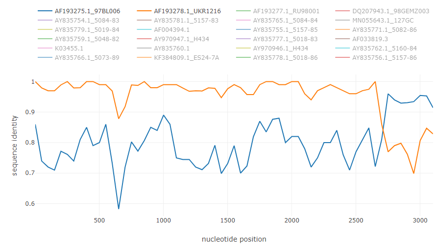
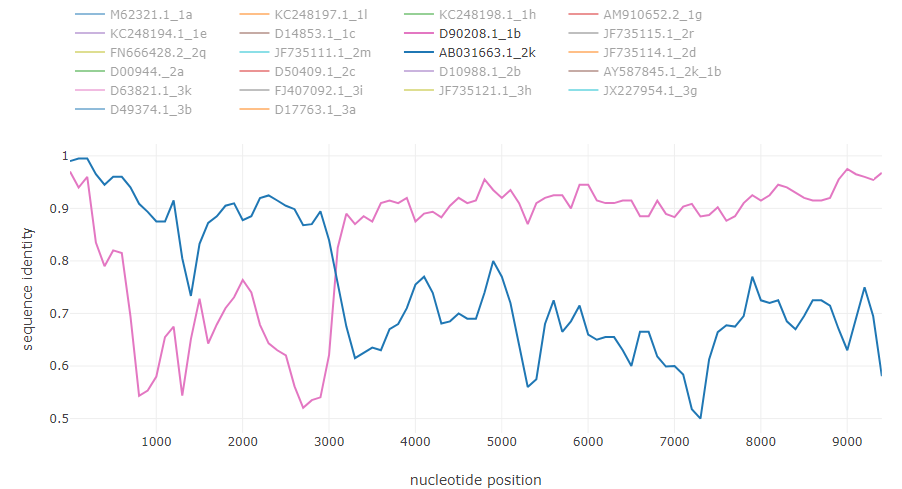

# Summary

Recombination is widespread in viruses and is considered to  be one of the mechanisms that drives viral evolutionary changes and helps viruses to overcome selective pressure and adapt to new environments (Pérez-Losada et al., 2015).
The similarity plot based on genetic distance between nucleotide sequences is an intuitive and simple way to explore and discover recombination events in viral genomes. 
Python package named ‘recan’ (recombination analyzer) allows to construct genetic distance plots and explore them interactively.  Recan is intended to be used via Jupyter notebook which is a popular instrument for data analysis.
The aim of the package is to give the researchers who are familiar with Python programming language a tool which can be used to quickly perform recombination analysis.
The advantage of the method above the distance methods implemented previously  in desktop software (Etherington, Dicks and Roberts, 2005)(Martin et al., 2015)(Lole et al., 1999) are its interactivity, speed, the ability to easily include sequences into or exclude them from the output without reconstructing the plot and recalculating the distance data, and, at last, the ability to analyze simultaneously several datasets during a single session.
Recan is based upon Biopython, Pandas, and Plotly libraries. 
The package requires sequence alignment in fasta format as an input. A user can control the sliding window size, the window shift, a method of distance calculation, a sequence of interest (which is a sequence potentially containing recombination region), and the alignment region, which will be included into distance calculation. Two methods of genetic distance calculation implemented so far are pairwise and Kimura 2-parameter distance.  After a recombination event is found, the distance data can be saved in csv or excel  file, or directly used to reconstruct the plot in Jupyter notebook with ones favorite plotting library to get a final report.

# Testing and verification
To test the package four previously reported recombinant viral genomes were used: human immunodeficiency virus (HIV) (Liitsola et al., 2000),hepatitis C virus (HCV) (Smith et al., 2014) norovirus (Jiang et al., 1999),and lumpy skin disease virus (LSDV) (Sprygin et al., 2018).
Each dataset included a recombinant sequence, its parental sequences and a number of other sequences of the same virus closely related to the recombinant.
HIV, HCV and Norovirus sequences were aligned with Clustal W (Larkin et al., 2007) and LSDV genomes were aligned with MAFFT (Katoh, 2002) algorithm by using the Ugene software (Okonechnikov et al., 2012)
Finally, HIV alignment included 25 sequences of the length 3135 bp, HCV alignment had 23 sequences of the length 9431, Norovirus alignment included 19 genomes of the length 3366, and LSDV dataset had 14 sequences by the length 150511 bp. 
Recan `simgen` method execution time with the default  `window` and `shift` parameters was the following:  437 ms ± 7.74 ms for HIV, 579 ms ± 58.7 ms for Norovirus, 648 ms ± 44.2 ms for HCV, and 3.55 s ± 239 ms for LSDV dataset. Time execution test was performed using the desktop PC which has 4-core CPU and 4 Gb RAM. 
LSDV genome is about 150 000 bp long and is one of the largest among viruses. Typically researches study recombination events using the viruses which genomes are way smaller. But even in the case of analyzing the dataset which includes up to 14 large viral genomes recan execution time is quite reasonable.
Recombination events in datasets detected by recan are shown in Figures 1-4. 

# Availability and implementation
Recan can be installed by pip Python package manager using `pip install recan` command. The source code, guide and datasets used in the study are available at https://github.com/babinyurii/recan. Recan is supported on Linux and Windows.

_Figure 1. HIV recombinant strain AF193276 between sequences AF193275 and AF193278_

_Figure 2. HCV intergenotype recombinant 2k/1b_

_Figure 3. Norovirus  recombinant AF190817 between parental sequences U22498 and X86557_

_Figure 4. LSDV recombinant vaccine-like strain LSDV RUSSIA/Saratov/2017 between AF193275 and KY829023_

# References
